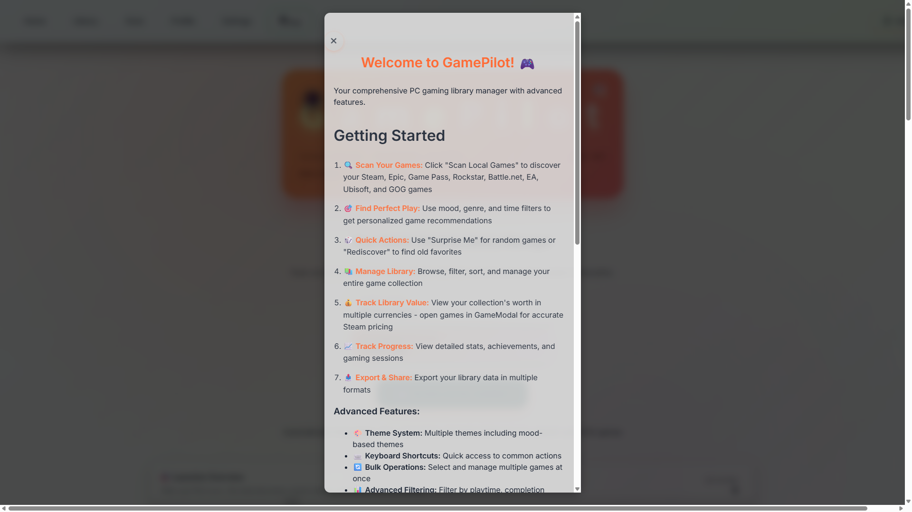

# GamePilot

### Your library. Your stats. Your machine.

**Version 1.9.0** | **Copyright © 2026 Moz** | **MIT License** | **Local-first · Private · Open source**

GamePilot is a local-first desktop app that unifies your game library across every launcher, tracks your playtime (even offline), and turns your collection into a private, gamified dashboard — without accounts, cloud sync, or telemetry of any kind.

---

## Why GamePilot?

**🔓 Open source — verify, don't trust.**
Most launchers ask you to trust them with your data. GamePilot lets you read every line before you install.

**🔒 100% local & private.**
No accounts, no cloud, no telemetry. Your library and stats never leave your machine.

**🛰️ Tracks even when Steam can't.**
GamePilot watches the game process itself, so your playtime keeps logging fully offline — perfect for laptops and travel.

**📊 Year in Review, every day.**
Playtime, longest sessions, busiest days, and top games — always on, not a once-a-year recap.

**⚔️ Your library, leveled up.**
A gaming identity that learns your habits, recommendations that explain *why*, and XP / achievements / rewards that make your backlog fun.

---

## Screenshots

> Screenshots live in the [`screenshots/`](screenshots/) folder.



---

## Features

### 📚 Library Management
- Scan and import games from Steam, Epic Games, GOG, Origin, Ubisoft Connect, Battle.net, Rockstar Games, Xbox Game Pass, and PlayStation
- Track playtime, completion status, and personal ratings
- Organize games by mood, genre, and platform
- Export library data in multiple formats

### 📊 Stats & Year in Review
- Always-available playtime dashboard (daily / weekly / monthly / yearly / all time)
- Imports your real Steam lifetime playtime, clearly separated from GamePilot-tracked sessions
- Switchable hours / days display for huge playtime totals
- Deeper play habits: longest session, busiest day, late-night & weekend runs

### 🎯 Smart Recommendations (Perfect Play)
- Recommendations based on mood, genre, and available playtime
- Explains *why* each game was picked
- Tunable novelty, diversity, and exploration controls

### ⚔️ Gaming Identity & Progression
- A behavioural profile that learns how you actually play
- XP, achievements, challenges, and rewards layered over your backlog

### � Game Compatibility & Performance
- 770+ game database with detailed system requirements
- Real-time compatibility checking and estimated FPS against your hardware
- Performance Cockpit: bottleneck detection and upgrade recommendations

### 💰 Library Valuation
- Calculate total library value with multi-currency support
- Real-time price conversion from Steam pricing

### Customization
- Multiple themes, dark/light mode, big-screen (TV) mode, and flexible layouts

## Installation

### Windows
1. Download `GamePilot Setup 1.9.0.exe` from the releases page
2. Run the installer
3. Follow the installation wizard
4. Launch GamePilot from your Start Menu

### Linux / Steam Deck beta

Linux support is Steam-first and remains a beta until it has been validated on physical handheld hardware. Download the x86_64 AppImage, mark it executable, and launch it from Desktop Mode. Steam Deck users can then add the AppImage to Steam as a non-Steam game for Gaming Mode.

```bash
chmod +x GamePilot-1.9.0.AppImage
./GamePilot-1.9.0.AppImage
```

The beta supports Steam library discovery and Steam protocol launching. Windows-only launchers and platform tools are intentionally unavailable on Linux.

### Development Setup
```bash
npm install
npm start
```

### Building
```bash
npm run build
npm run build-electron-win
npm run build-electron-linux
```

Linux AppImage packaging requires a Linux host or the included Ubuntu CI workflow.

## Usage

### Scanning Your Library
1. Open GamePilot
2. Click "Scan Library" to detect games from all installed platforms
3. Wait for the scan to complete
4. Your library will be automatically saved

### Checking Game Compatibility
1. Click on any game in your library
2. View the "System Compatibility" section
3. See minimum, recommended, and ultra requirements
4. Check estimated FPS for your system

### Performance Analysis
1. Navigate to the Performance Cockpit
2. View your system specifications and scores
3. Check bottleneck analysis
4. Review upgrade recommendations with costs

### Getting Recommendations
1. Go to Perfect Play Selector
2. Select your mood and preferred genres
3. Choose available playtime
4. Get personalized recommendations

## License & Privacy

### License
GamePilot is open source under the MIT License. See [LICENSE](LICENSE) for full details.

**What this means:**
- ✅ You can view, study, and learn from the source code
- ✅ You can use GamePilot for personal projects
- ✅ You can modify the code for your own use
- ❌ You cannot claim GamePilot as your own work
- ❌ You cannot use the author's name to endorse your products

### Privacy Policy

**Summary:**
- ✅ Zero data collection
- ✅ Local-only operation
- ✅ No cloud storage
- ✅ No telemetry or tracking
- ✅ Your data, your control

### Source Code
The complete source code is available for download on itch.io as "Source Code (View Only)". This allows you to:
- Study how GamePilot works
- Learn from the implementation
- Understand the local-first architecture
- Verify the privacy claims

For running GamePilot, please download the installer from the main downloads section.

## System Requirements

### Minimum
- Windows 10 or later, or a modern x86_64 Linux distribution for the beta
- 4GB RAM
- 500MB free disk space
- Intel i5, AMD equivalent, or Steam Deck

### Recommended
- Windows 11 or current SteamOS
- 8GB+ RAM
- SSD with 1GB free space
- Intel i7, AMD Ryzen 7, or equivalent

## Data Storage

All GamePilot data is stored locally on your computer:

```text
Windows: C:\Users\[YourUsername]\AppData\Roaming\GamePilot\
Linux:   ~/.config/GamePilot/
```

You can:
- Backup your data manually
- Export your library at any time
- Delete all data by removing the folder
- Access raw data files directly

## Troubleshooting

### Library Scan Not Finding Games
- Ensure Steam/Epic/GOG are installed in standard locations
- Check that game folders have proper permissions
- Try running GamePilot as Administrator

### Compatibility Showing "Unknown"
- Game may not be in the 770+ game database
- System will estimate compatibility based on your hardware
- Check Game Modal for detailed analysis

### Performance Page Not Updating
- Refresh the page or restart GamePilot
- Ensure library has been scanned
- Check that system info was detected correctly

## Support & Contact

For issues, questions, or suggestions, contact the author directly.

## Changelog

### v1.7.0 (Current)
- ✅ Gaming identity now grounded in real play data — dominant genre, game count, hours played, and top games
- ✅ Home page Habit Insights shows taste clusters (Souls-like, Roguelike, Platformer, etc.) based on signature games
- ✅ Insights mood display now shows top 3 moods with accurate "sessions" labelling
- ✅ Removed duplicate smart shelves (Discovery, Weekend Ready) for cleaner home page
- ✅ Audio reward catalog and bundled audio assets removed to reduce install size
- ✅ Core recommendation path decoupled from heavy hardware database
- ✅ Secondary and Labs routes lazy-loaded for faster startup

### v1.5.0
- ✅ Fixed Steam playtime import in packaged builds (resilient scanner loading)
- ✅ Imported Steam lifetime playtime now surfaced on the All Time view, separate from tracked sessions
- ✅ Most Played Games can switch between GamePilot-tracked and Steam-imported rankings
- ✅ Hours / days display toggle for large playtime totals
- ✅ Clearer "Tracked by GamePilot" vs "Steam Lifetime" labelling

### v1.4.0
- ✅ Enhanced Year in Review with deeper stats (longest session, busiest day, repeat games)
- ✅ Added period-aware deeper insights to Stats page
- ✅ Fixed Epic mystery games in Free Games Radar
- ✅ Improved local-first session aggregation
- ✅ Source code available for viewing

### v1.1.0 (March 14, 2026)
- ✅ Added 770+ game compatibility database
- ✅ Integrated real-time compatibility badges
- ✅ Added detailed system requirements modal
- ✅ Implemented Performance Cockpit analysis
- ✅ Added multi-currency support for upgrade costs
- ✅ Improved GPU scoring accuracy
- ✅ User-friendly compatibility labels

### v1.0.0 (Previous)
- Initial release with library management and basic features

---

**GamePilot is your personal gaming companion. Enjoy!** 🎮
